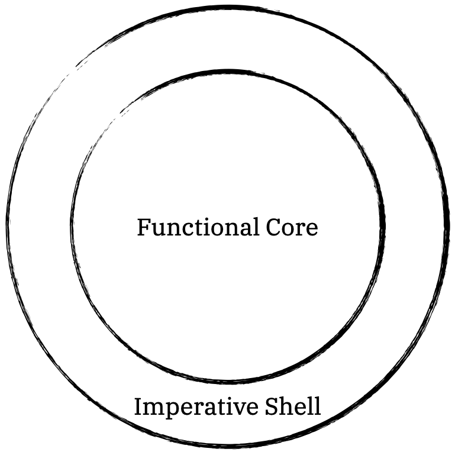

Functional core, imperative shell is a pattern that structures software into two
basic parts:

- The part that only depends on the inputs to produce the
  desired output -- the pure functions -- and

- the part that handles the interactions with the outside world -- impure
  functions that handle the statefule infrastructure.

The typical visualization shows a big functional core where all the pure
functions live, and a thin functional shell where the impure functions interface
with the outside world:

The domain logic -- *what* the software does -- is part of the functional core.
The lack of side-effects and infrastructure makes the functions of the core
easily testable since there is no need to bring up parts of the infrastructure
or manage state for testing.

The imperative shell orchestrates all the impure effects that a software needs
to be able to interact with the outside world.  It takes inputs from the
external world (e.g., user input, network requests) and orchestrates how those
inputs flow into the functional core. It then takes the results from the core
and applies side effects, such as writing to a database or sending a response
back to the user.  In the shell, the programs can handle all the impure
interactions and take care of errors, non-deterministic behaviour, and
exceptions in concert.  The functions in the shell call the functions in the
core with the pure values obtained from the impure interactions.  The functions
in the core never call the shell.

Since this pattern brings about a separation of concerns between domain logic
from the infrastructure's technical details, the domain logic and infrastracture
are decoupled from each other: Parts of the infrastructure can easily be updated
or swapped out without the need to touch the domain logic at all.

## Example

FIXME

## When to reach for this pattern

It is always recommended to reach for this pattern as it always improves
separation of concerns, testability, and maintainability.

## Shortcomings

Although all the non-deterministic and effectful interactions are orchestrated
in the shell -- which is unequivocally positive -- the shell is likely to grow
quite complex and hard to maintain in large programs.  The natural evolution is
to make even more functions pure.  This can be achieved by representing
effectful interactions as pure values and separating the evaluation and
effectful execution from their pure representations.  See [Composable
Effects](/composable_effects) for details.

## When _not_ to reach for this pattern

FIXME

- Memoization
- unsafeRunIO
- ...?
